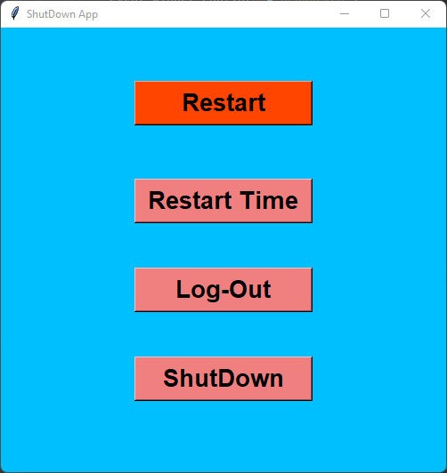

# Shutdown Application with Python 

**Shutdown App with Tkinter** is a simple Python GUI application that allows users to perform various shutdown, restart, log-out, and restart with  time operations on their computer. It provides an intuitive interface with interactive buttons that change color when hovered over.

## Features

- **Shutdown:** Immediately shuts down your computer.
- **Restart:** Restart your computer immediately.
- **Restart Time:** Restart your computer with a 20-second delay.
- **Log-Out:** Logs out of the current user session.

## Usage

1. Click the "Restart" button to initiate a system restart immediately.
2. Use the "Restart Time" button to schedule a restart with a custom time delay (e.g., 20 seconds).
3. Click the "Log-Out" button to log out of the user account.
4. Execute a graceful system shutdown by clicking the "ShutDown" button.

## Steps to Create the Project

1. Import the Required Modules
2. Create the GUI Window
3. Shutdown Function
4. Logout Function
5. Restart Function

## Customize the Code

You can easily customize the app by adjusting the button styles, colors, and functionality in the `Shutdown_App.py` script.

## Compatibility

This app is compatible with Windows operating systems. For other operating systems, you may need to modify the code accordingly.

## Contributing

If you'd like to contribute to this project or report any issues, please open an [issue](https://github.com/zahid60/Shutdown_App/issues) or submit a [pull request](https://github.com/zahid60/Shutdown_App/pulls).

Feel free to use, modify, and share this app as needed.

Happy coding! 😄

